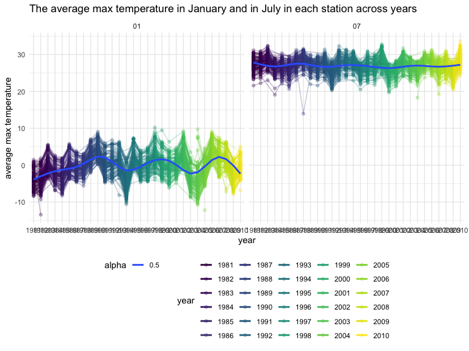

p8105_hw3_yc4016
================
Yishan Chen
2022-10-07

# Problem 1

``` r
data("instacart")

instacart = 
  instacart %>% 
  as_tibble(instacart)
```

#### Description

-   The size of the dataset `instacart` is 1384617, 15
-   The dataset `instacart` contains 1384617 rows and 15 with each row
    resprenting a single product from an instacart order.
-   The key variables include order_id, product_id, add_to_cart_order,
    reordered, user_id, eval_set, order_number, order_dow,
    order_hour_of_day, days_since_prior_order, product_name, aisle_id,
    department_id, aisle, department
-   In total, there are 39123 products found in 131209 orders from
    131209 distinct users.

#### Question Prompt

How many aisles are there, and which aisles are the most items ordered
from?

``` r
instacart %>% 
  count(aisle) %>% 
  arrange(desc(n))
```

    ## # A tibble: 134 × 2
    ##    aisle                              n
    ##    <chr>                          <int>
    ##  1 fresh vegetables              150609
    ##  2 fresh fruits                  150473
    ##  3 packaged vegetables fruits     78493
    ##  4 yogurt                         55240
    ##  5 packaged cheese                41699
    ##  6 water seltzer sparkling water  36617
    ##  7 milk                           32644
    ##  8 chips pretzels                 31269
    ##  9 soy lactosefree                26240
    ## 10 bread                          23635
    ## # … with 124 more rows

#### Description

-   In total, there are 134 aisles, with fresh vegetables and fresh
    fruits holding the most items ordered by far.

#### Question Prompt

Next is a plot that shows the number of items ordered in each aisle.
Here, aisles are ordered by ascending number of items.

``` r
instacart %>% 
  count(aisle) %>% 
  filter(n > 10000) %>% 
  mutate(aisle = fct_reorder(aisle, n)) %>% 
  ggplot(aes(x = aisle, y = n)) + 
  geom_point() + 
  labs(title = "Number of items ordered in each aisle") +
  theme(axis.text.x = element_text(angle = 60, hjust = 1))
```


#### Question Prompt

Our next table shows the three most popular items in aisles
`baking ingredients`, `dog food care`, and `packaged vegetables fruits`,
and includes the number of times each item is ordered in your table.

``` r
instacart %>% 
  filter(aisle %in% c("baking ingredients", "dog food care", "packaged vegetables fruits")) %>%
  group_by(aisle) %>% 
  count(product_name) %>% 
  mutate(rank = min_rank(desc(n))) %>% 
  filter(rank < 4) %>% 
  arrange(desc(n)) %>%
  knitr::kable()
```

| aisle                      | product_name                                  |    n | rank |
|:---------------------------|:----------------------------------------------|-----:|-----:|
| packaged vegetables fruits | Organic Baby Spinach                          | 9784 |    1 |
| packaged vegetables fruits | Organic Raspberries                           | 5546 |    2 |
| packaged vegetables fruits | Organic Blueberries                           | 4966 |    3 |
| baking ingredients         | Light Brown Sugar                             |  499 |    1 |
| baking ingredients         | Pure Baking Soda                              |  387 |    2 |
| baking ingredients         | Cane Sugar                                    |  336 |    3 |
| dog food care              | Snack Sticks Chicken & Rice Recipe Dog Treats |   30 |    1 |
| dog food care              | Organix Chicken & Brown Rice Recipe           |   28 |    2 |
| dog food care              | Small Dog Biscuits                            |   26 |    3 |

#### Question Prompt

Finally is a table showing the mean hour of the day at which Pink Lady
Apples and Coffee Ice Cream are ordered on each day of the week. This
table has been formatted in an untidy manner for human readers. Pink
Lady Apples are generally purchased slightly earlier in the day than
Coffee Ice Cream, with the exception of day 5.

``` r
instacart %>%
  filter(product_name %in% c("Pink Lady Apples", "Coffee Ice Cream")) %>%
  group_by(product_name, order_dow) %>%
  summarize(mean_hour = mean(order_hour_of_day)) %>%
  spread(key = order_dow, value = mean_hour) %>%
  knitr::kable(digits = 2)
```

    ## `summarise()` has grouped output by 'product_name'. You can override using the
    ## `.groups` argument.

| product_name     |     0 |     1 |     2 |     3 |     4 |     5 |     6 |
|:-----------------|------:|------:|------:|------:|------:|------:|------:|
| Coffee Ice Cream | 13.77 | 14.32 | 15.38 | 15.32 | 15.22 | 12.26 | 13.83 |
| Pink Lady Apples | 13.44 | 11.36 | 11.70 | 14.25 | 11.55 | 12.78 | 11.94 |

# Problem 2

#### Question Prompt

Load, tidy, and otherwise wrangle the data. Your final dataset should
include all originally observed variables and values; have useful
variable names; include a weekday vs weekend variable; and encode data
with reasonable variable classes. Describe the resulting dataset
(e.g. what variables exist, how many observations, etc).

``` r
accelerometers = 
  read_csv("data/accel_data.csv") %>% 
  janitor::clean_names() %>% 
  pivot_longer(
    activity_1:activity_1440,
    names_to = "activity_each_minute",
    names_prefix = "activity_",
    values_to = "counts"
  ) %>% 
  mutate(
    weekday_vs_weekend = if_else(day %in% c("Saturday", "Sunday"), 1, 0),
    weekday_vs_weekend = as.factor(weekday_vs_weekend)
         ) 
```

    ## Rows: 35 Columns: 1443
    ## ── Column specification ────────────────────────────────────────────────────────
    ## Delimiter: ","
    ## chr    (1): day
    ## dbl (1442): week, day_id, activity.1, activity.2, activity.3, activity.4, ac...
    ## 
    ## ℹ Use `spec()` to retrieve the full column specification for this data.
    ## ℹ Specify the column types or set `show_col_types = FALSE` to quiet this message.

``` r
accelerometers
```

    ## # A tibble: 50,400 × 6
    ##     week day_id day    activity_each_minute counts weekday_vs_weekend
    ##    <dbl>  <dbl> <chr>  <chr>                 <dbl> <fct>             
    ##  1     1      1 Friday 1                      88.4 0                 
    ##  2     1      1 Friday 2                      82.2 0                 
    ##  3     1      1 Friday 3                      64.4 0                 
    ##  4     1      1 Friday 4                      70.0 0                 
    ##  5     1      1 Friday 5                      75.0 0                 
    ##  6     1      1 Friday 6                      66.3 0                 
    ##  7     1      1 Friday 7                      53.8 0                 
    ##  8     1      1 Friday 8                      47.8 0                 
    ##  9     1      1 Friday 9                      55.5 0                 
    ## 10     1      1 Friday 10                     43.0 0                 
    ## # … with 50,390 more rows

#### Description

-   The size of the dataset `accelerometers` is 50400, 6
-   The dataset `accelerometers` contains 50400 rows and 6 columns
-   The dataset `accelerometers` contains 50400 observations
-   The key variables include week, day_id, day, activity_each_minute,
    counts, weekday_vs_weekend

#### Question Prompt

Traditional analyses of accelerometer data focus on the total activity
over the day. Using your tidied dataset, aggregate across minutes to
create a total activity variable for each day, and create a table
showing these totals. Are any trends apparent?

``` r
accelerometers_table =
accelerometers %>% 
  group_by(week, day) %>% 
  summarize(total_activity = sum(counts)) %>% 
  pivot_wider(
    names_from = "day",
    values_from = "total_activity") %>% 
  select (Monday, Tuesday, Wednesday, Thursday, Friday, Saturday, Sunday) %>% 
  knitr::kable()
```

    ## `summarise()` has grouped output by 'week'. You can override using the
    ## `.groups` argument.
    ## Adding missing grouping variables: `week`

``` r
accelerometers_table
```

| week |    Monday |  Tuesday | Wednesday | Thursday |   Friday | Saturday | Sunday |
|-----:|----------:|---------:|----------:|---------:|---------:|---------:|-------:|
|    1 |  78828.07 | 307094.2 |    340115 | 355923.6 | 480542.6 |   376254 | 631105 |
|    2 | 295431.00 | 423245.0 |    440962 | 474048.0 | 568839.0 |   607175 | 422018 |
|    3 | 685910.00 | 381507.0 |    468869 | 371230.0 | 467420.0 |   382928 | 467052 |
|    4 | 409450.00 | 319568.0 |    434460 | 340291.0 | 154049.0 |     1440 | 260617 |
|    5 | 389080.00 | 367824.0 |    445366 | 549658.0 | 620860.0 |     1440 | 138421 |

#### Description

-   It seems that the weekends has lower value than weekdays.
-   At Saturday of week 4 and 5 the number is pretty small.

#### Question Prompt

Accelerometer data allows the inspection activity over the course of the
day. Make a single-panel plot that shows the 24-hour activity time
courses for each day and use color to indicate day of the week. Describe
in words any patterns or conclusions you can make based on this graph.

``` r
accelerometers_plot = 
accelerometers %>% 
  ggplot(aes(x = activity_each_minute, y = counts, color = day)) +
  geom_line(alpha = .5) +
  geom_smooth(se = FALSE) +
  labs(title = "The 24-hour activity time courses for each day", 
       x = "activity time", 
       y = "activity value") + 
  scale_x_discrete(
    breaks = c(0, 6, 12, 18, 24), 
    labels = c("00:00","06:00","12:00","18:00","24:00"))

accelerometers_plot
```

    ## `geom_smooth()` using method = 'loess' and formula 'y ~ x'


#### Description

-   At around 12:00 and 07:00, the are two large peak with higher
    activity values.
-   At around 18:00 - 24:00, the activity values are small.

# Problem 3

``` r
library(p8105.datasets)
data("ny_noaa")
```

#### Description

-   The size of the dataset `ny_noaa` is 2595176, 7
-   The dataset `ny_noaa` contains 2595176 rows and 7
-   The key variables include id, date, prcp, snow, snwd, tmax, tmin

#### Question Prompt

Do some data cleaning. Create separate variables for year, month, and
day. Ensure observations for temperature, precipitation, and snowfall
are given in reasonable units. For snowfall, what are the most commonly
observed values? Why?

``` r
ny_noaa_df = 
ny_noaa %>% 
  janitor::clean_names() %>% 
  separate(date, into = c("year", "month", "day"), sep = "-" ) %>% 
  mutate(
    tmax = as.integer(tmax), 
    tmin = as.integer(tmin),
    tmax = tmax / 10, 
    tmin = tmin / 10,
    prcp = prcp / 10)

ny_noaa_df
```

    ## # A tibble: 2,595,176 × 9
    ##    id          year  month day    prcp  snow  snwd  tmax  tmin
    ##    <chr>       <chr> <chr> <chr> <dbl> <int> <int> <dbl> <dbl>
    ##  1 US1NYAB0001 2007  11    01       NA    NA    NA    NA    NA
    ##  2 US1NYAB0001 2007  11    02       NA    NA    NA    NA    NA
    ##  3 US1NYAB0001 2007  11    03       NA    NA    NA    NA    NA
    ##  4 US1NYAB0001 2007  11    04       NA    NA    NA    NA    NA
    ##  5 US1NYAB0001 2007  11    05       NA    NA    NA    NA    NA
    ##  6 US1NYAB0001 2007  11    06       NA    NA    NA    NA    NA
    ##  7 US1NYAB0001 2007  11    07       NA    NA    NA    NA    NA
    ##  8 US1NYAB0001 2007  11    08       NA    NA    NA    NA    NA
    ##  9 US1NYAB0001 2007  11    09       NA    NA    NA    NA    NA
    ## 10 US1NYAB0001 2007  11    10       NA    NA    NA    NA    NA
    ## # … with 2,595,166 more rows

``` r
snow_frequency = 
  ny_noaa %>% 
  count(snow, name = "frequency") %>% 
  arrange(desc(frequency))

snow_frequency
```

    ## # A tibble: 282 × 2
    ##     snow frequency
    ##    <int>     <int>
    ##  1     0   2008508
    ##  2    NA    381221
    ##  3    25     31022
    ##  4    13     23095
    ##  5    51     18274
    ##  6    76     10173
    ##  7     8      9962
    ##  8     5      9748
    ##  9    38      9197
    ## 10     3      8790
    ## # … with 272 more rows

#### Description

-   For snowfall, “0” is the most commonly observed values with
    frequency 2008508.

#### Question Prompt

Make a two-panel plot showing the average max temperature in January and
in July in each station across years. Is there any observable /
interpretable structure? Any outliers?

``` r
ny_noaa_plot = 
ny_noaa_df %>% 
  filter (month %in% c("01", "07")) %>% 
  group_by(month, year, id) %>% 
  summarize (tmax_mean = mean(tmax,na.rm = TRUE)) %>% 
  ggplot(aes(x = year, y = tmax_mean, group = id, color = year)) + 
  geom_point(alpha = 0.3) + 
  geom_line(alpha = 0.3) + 
  geom_smooth(aes(group=month, alpha = 0.5), se = FALSE) + 
  labs(title = "The average max temperature in January and in July in each station across years", 
       x = "year", 
       y = "average max temperature") +
    facet_grid(.~month)
```

    ## `summarise()` has grouped output by 'month', 'year'. You can override using the
    ## `.groups` argument.

``` r
ny_noaa_plot
```

    ## `geom_smooth()` using method = 'gam' and formula 'y ~ s(x, bs = "cs")'



#### Description

-   Both January and July data have outliers
-   For January the trend of average max temperature is changing
    (increasing and decreasing) across years.
-   For July the average max temperature is approximately unchanged
    across years.

#### Question Prompt

Make a two-panel plot showing (i) tmax vs tmin for the full dataset
(note that a scatterplot may not be the best option); and (ii) make a
plot showing the distribution of snowfall values greater than 0 and less
than 100 separately by year.

``` r
plot_1 =
  ny_noaa_df %>% 
  ggplot(aes(x = tmax, y = tmin)) +
  geom_hex() +
  labs(title = "tmax vs tmin", 
       x = "tmax", 
       y = "tmin")

plot_2 =
  ny_noaa_df %>% 
  filter (snow > 0 & snow < 100) %>% 
  ggplot(aes(x = snow, fill = year)) +
  geom_density(alpha = .4, adjust = .5, color = "blue") +
  labs(title = "Distribution of snowfall values greater than 0 and less than 100 separately by year", 
       x = "snowfall", 
       y = "density")

plot_1 + plot_2
```


